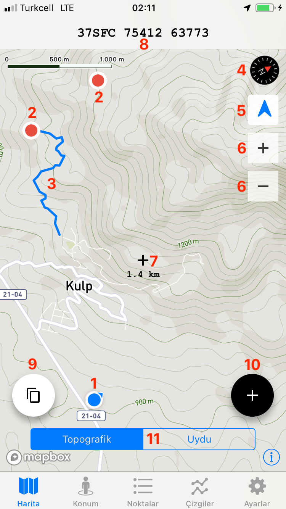

# Dökümantasyon

## Hakkında

Mnhani iOS için bir askeri GPS uygulamasıdır.

### Kütüphaneler


* versiyon 3.4
* build 14
* swift 4.1
* mapbox 4.1.1
* material design 56
* formtoolbar 1.1


### Yapılacaklar Listesi

* [x] Sade ve Hızlı 
* [x]  Kolay koordinat paylaşma
* [x]  Türkçe
* [x] Topografik harita 
* [ ] Çevrimdışı harita 
* [ ] 3 Boyutlu harita 
* [ ] Grid çizgileri
* [x] Nokta ekleme
* [ ] Eklenen noktaları gruplama 
* [x] Çizgi ekleme 
* [ ] Alan ekleme 

## Uygulama Yapısı ve Kullanım Kılavuzu

### Harita

Harita Mapbox servis sağlayıcısı tarafından sağlanan Open Cycle Map'tir.

1. Konumunuzu ve yönünüzü gösteren işaret.
2. Kaydettiğiniz noktalar. Bu noktaları seçtiğinizde noktanın adını ve koordinatlarını görebilirsiniz.
3. Kaydettiğiniz çizgiler.
4. Haritanın yönünü gösteren pusula.
5. Konumunuzu takip etmeye yarayan düğme.
6. Harita yakınlaştırma ve uzaklaştırma düğmeleri.
7. Haritanın merkezi ve sizin bu noktaya olan mesafeniz. Kayıtlı bir noktaya olan mesafenizi ölçmek için o noktayı seçerek haritanın merkezine gelmesini sağlayabilir ya da haritayı sürükleyerek merkeze getirebilirsiniz.
8. Harita merkezinin koordinatları.
9. Paylaşmak için harita merkezinin koordinatlarını kopyalar. Böylece istediğiniz platformda \(mesajlaşma, not alma vb.\) yapıştırarak kullanabilirsiniz.
10. Harita merkezine nokta veya çizgi ekleme düğmesi.
11. Harita görüntüsünü değiştiren düğmeler.

